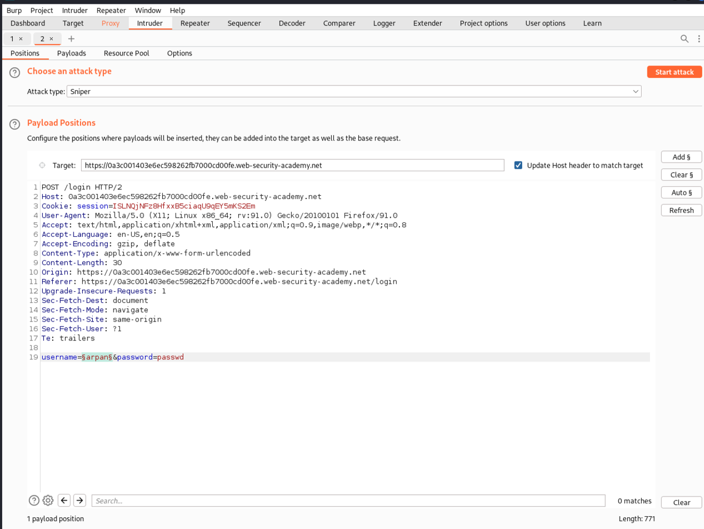
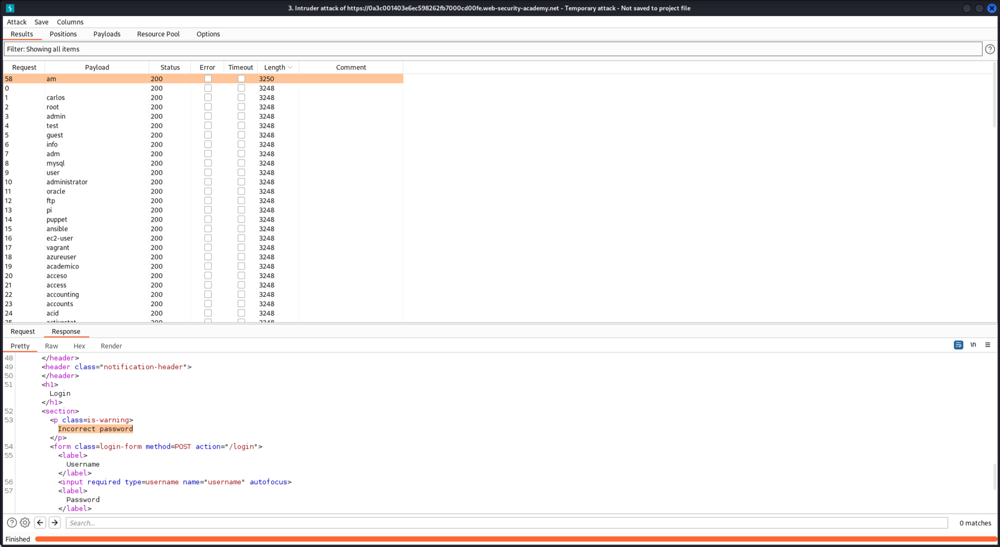
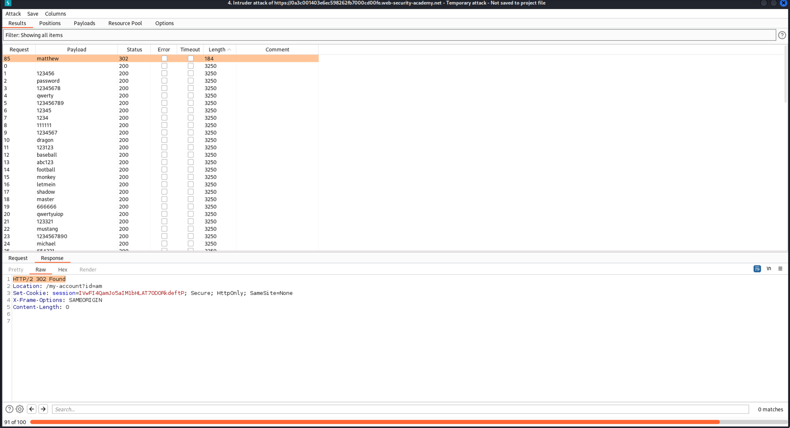
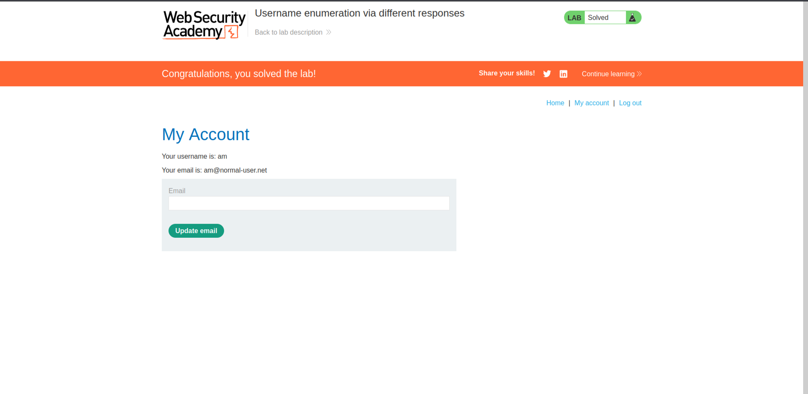
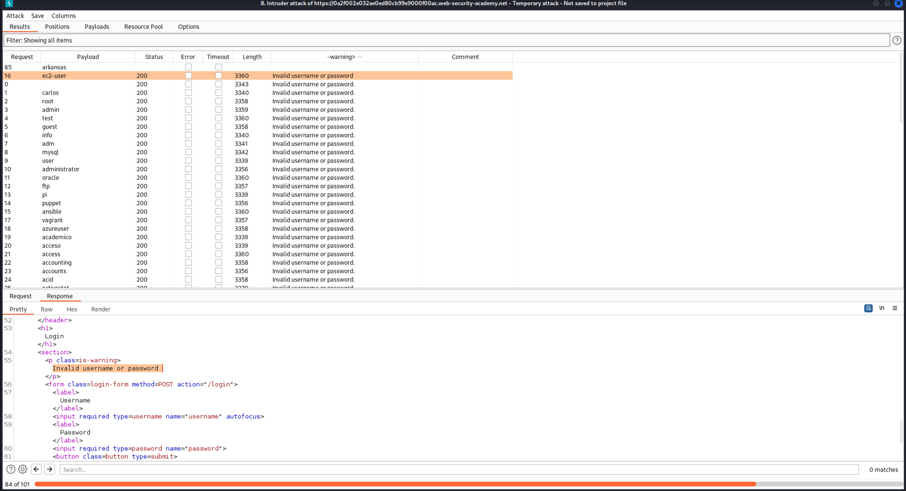
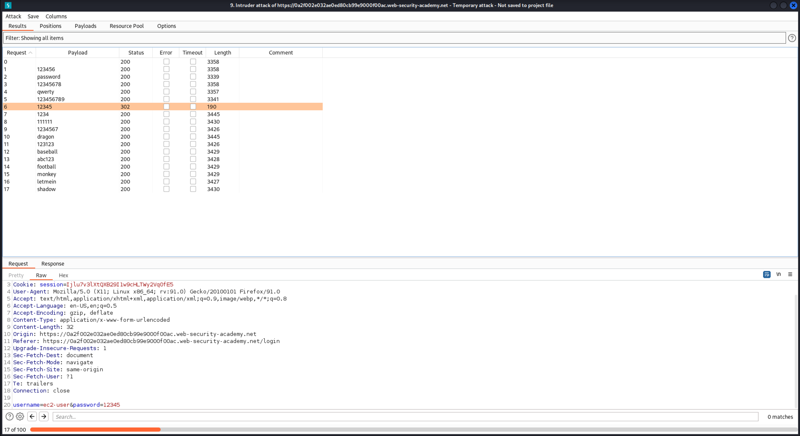
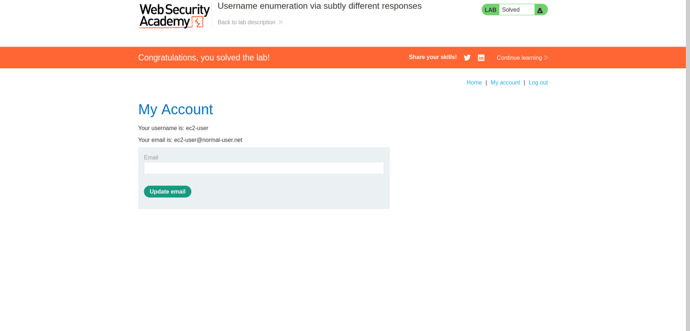

# Authentication Vulnerabilities

I learned about [authentication vulnerabilities](https://portswigger.net/web-security/learning-paths/authentication-vulnerabilities): brute-force attacks on username and password.

Solved two labs from [portswigger](https://portswigger.net/web-security/dashboard).

## [Lab 1: Username enumeration via different responses](https://portswigger.net/web-security/authentication/password-based/lab-username-enumeration-via-different-responses)

### Writeup:
- Click on My account and try to login. Intercept the request through Burp Suite, we can see the username and password being passed on. 
- Send it to Intruder and let's brute-force the usernames to identify the correct one. If the username is incorrect, it sends "username incorrect" and when the username is correct but the password is not, it sends "password incorrect". Let's filter through the response's length. We are able to guess the correct username: 
- Let's brute-force the password now that we know the username: 
- The lab is solved. 

## [Lab 2: Username enumeration via subtly different responses](https://portswigger.net/web-security/authentication/password-based/lab-username-enumeration-via-subtly-different-responses)

### Writeup:
- Go to My account and click on login, intercept the request, we can see the username and password being sent. When supplied with an invalid username or password or both, it says "invalid username or password". It doesn't mention if the username is incorrect or the password is incorrect.
- Let's enumerate the username through Intruder. Here, we aren't able to distinguish the correct username through content length and status code, so let's grep on the error message that we got, i.e., "Invalid username or password". Go to Options → Grep-Extract → Fetch response → highlight "invalid username or password". Then filter the results.
- On doing so, we get one response in which the period is omitted, so we know this is the correct username: 
- Let's brute-force the password now using that username. We get the password as it has a different status code: 
- The lab is solved. 
