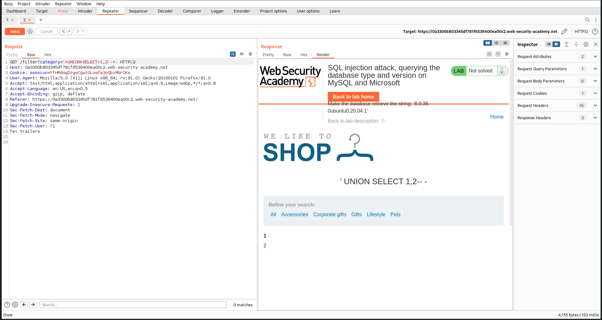
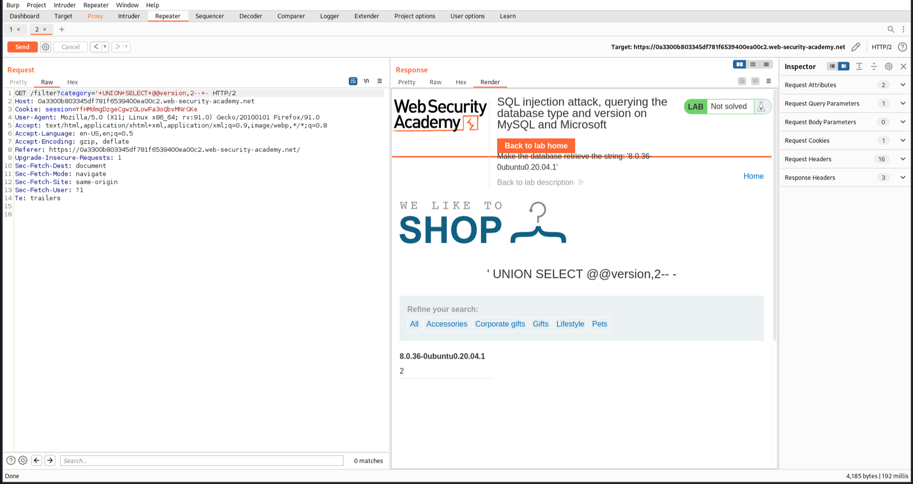
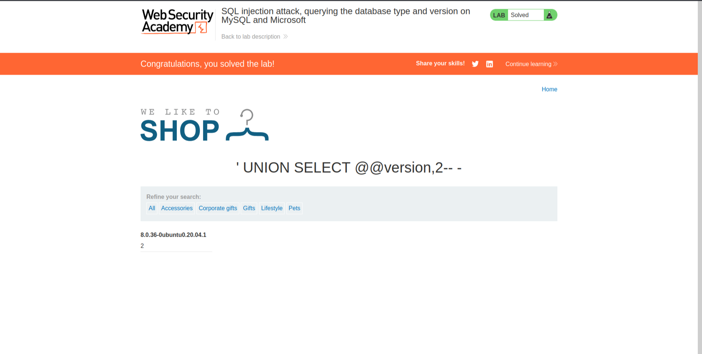

# SQL Vulnerabilities

Solved one lab from [portswigger academy](https://portswigger.net/web-security/dashboard).

## [Lab 12: SQL injection attack, querying the database type and version on MySQL and Microsoft](https://portswigger.net/web-security/sql-injection/examining-the-database/lab-querying-database-version-mysql-microsoft)

### Writeup:

- Click on one category and intercept the request. We can see a GET request is sent to ```/filter?category=Pets```.

- Try to manipulate the query by changing it to:
```category='+UNION+SELECT+1,2--+-```

- This returns "1" and "2" in the response, indicating that the query has two columns.


- Use this information to display the version of the database by changing the query to:
```category='+UNION+SELECT+@@version,2--+-```
- We get the database version.


- The lab is solved.

