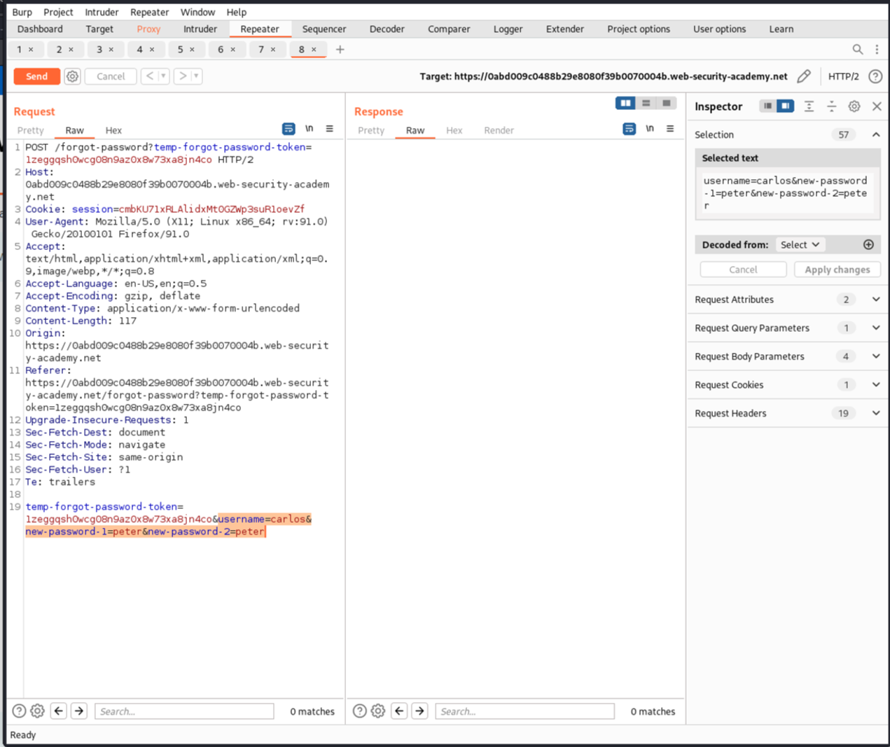

# Authentication Vulnerabilities

Solved two labs from [portswigger](https://portswigger.net/web-security/dashboard).

## [Lab 3: 2FA simple bypass](https://portswigger.net/web-security/authentication/multi-factor/lab-2fa-simple-bypass)

### Writeup:
- Log in with the credentials of the first user. You will be prompted to enter the multi-factor authentication code. Access the email client to retrieve the code, then enter it. You will be redirected to a URL such as website/my-account?id=user1.
- Log in with the credentials of the second user. When prompted for the multi-factor authentication code, change the URL to website/my-account?id=user2, similar to the URL format seen after the first user successfully logged in.
- By changing the URL, you bypass the multi-factor authentication.
- The lab is solved.

### [Lab 4: Password reset broken logic]( https://portswigger.net/web-security/authentication/other-mechanisms/lab-password-reset-broken-logic)

### Writeup:
- Click on "Forgot password". It prompts for the username. Enter your username, and an email is sent to your email client.
- In the email, there is a link to reset the password. Click the link to reset the password and intercept the request being sent. A token is passed along with the username.
- Remove the token and pass the request. It works, indicating that the token is not being validated.
- Now, try to reset the password but enter user2 in the username field. This allows us to reset the password for user2. 
- Log in with user2 and the new password.
- The lab is solved.  
