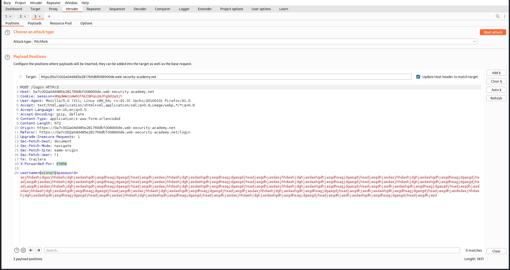
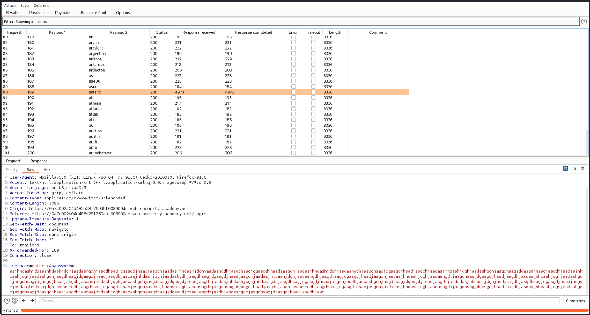
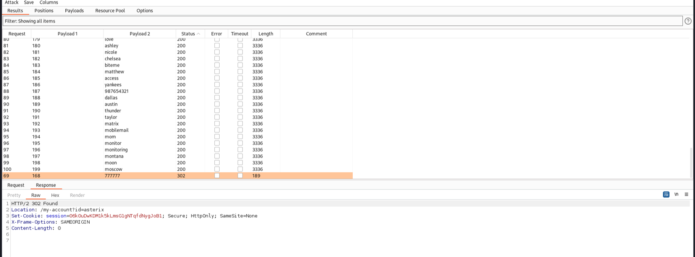
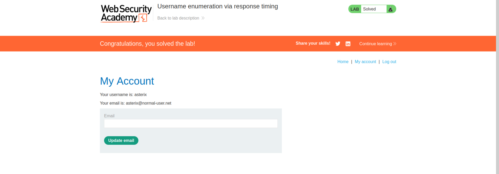

# Authentication Vulnerabilities

Solved one lab from [portswigger](https://portswigger.net/web-security/dashboard).

## [Lab 5: Username enumeration via response timing](https://portswigger.net/web-security/authentication/password-based/lab-username-enumeration-via-response-timing)

### Writeup:
- Try some random usernames and passwords. The application returns an error message saying "invalid username or password." After multiple attempts, it says "too many invalid login attempts" and blocks our IP.
- To bypass this, add an "X-Forwarded-For" header in the request with a unique value each time.
- When logging in, if we provide a valid username and an invalid but very long password, it takes more time to respond. Valid usernames take more time to respond than invalid ones , which can be used to enumerate the usernames.
- Forward the request to Intruder and brute-force the usernames with a very long password supplied. Change the value of "X-Forwarded-For" with each request. Run the brute-force attack using the Pitchfork attack type, which has one list for "X-Forwarded-For" values and another for usernames.

- Observe the timing of the requests and responses, which can be added from column in the Intruder brute-forcing window.
- Identify the request with the longest response time, indicating a valid username.

- Next, brute-force the password.
- Upon successful brute-forcing, we get a valid password as indicated by a status code 302.

- The lab is solved.
