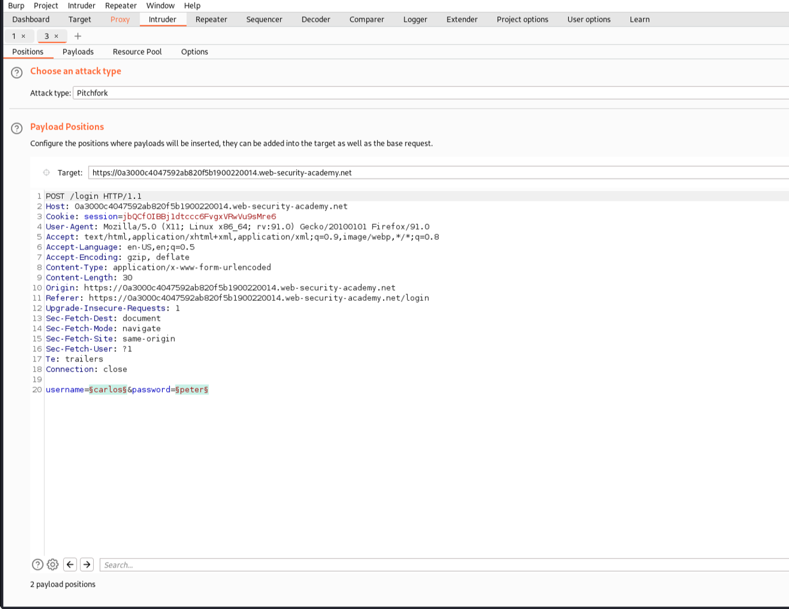
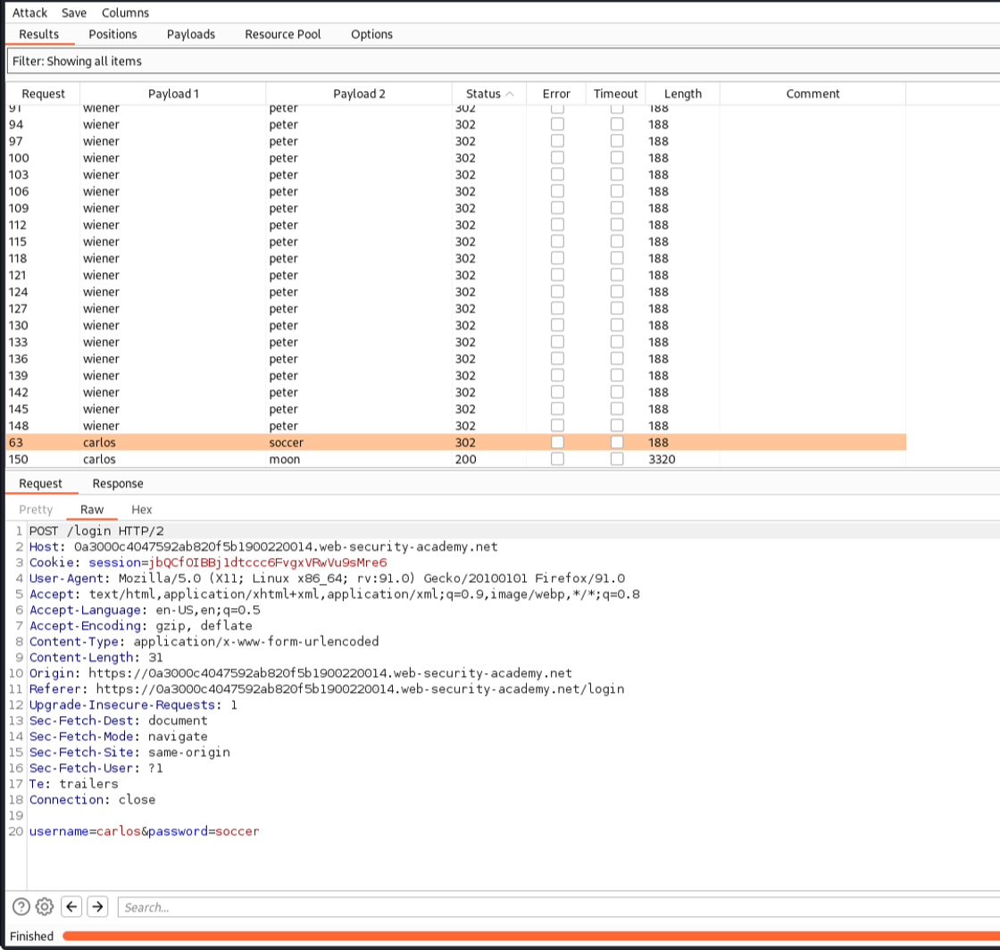
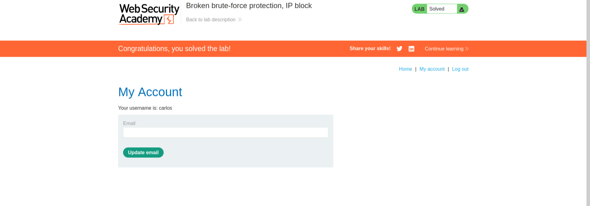

# Authentication Vulnerabilities

Solved one lab from [portswigger](https://portswigger.net/web-security/dashboard).

## [Lab 6: Broken brute-force protection, IP block](https://portswigger.net/web-security/authentication/password-based/lab-broken-bruteforce-protection-ip-block )

### Writeup:
- Lets try with some invalid username and password. It explicitly mentions if username is incorrect or if password is incorrect. Incorret login blocks your IP after 3 unsuccessful login , But when we make successful login , the counter reduces to 0 and we can attempt to make other unsuccessful login attempts.
- As we have been given valid username and password(wiener-peter) , and also another valid username(carlos) whose password should be bruteforced. Lets send the request to intruder.
- We should make a list of username where after 2 unsuccessful login attempts, we provide with the correct username and same for password as well, So make a list and then we can brute-force on username(winer and carlos) and password(peter and other random try)

- In the result we can filter the results that returned 302 success and see which has username as carlos.
- We get the password. 
- The lab is solved.
