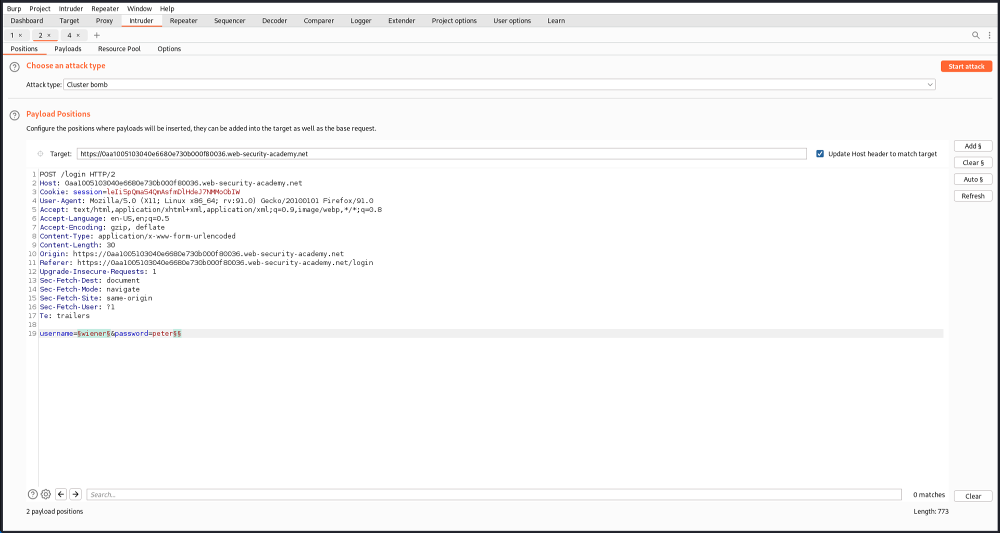
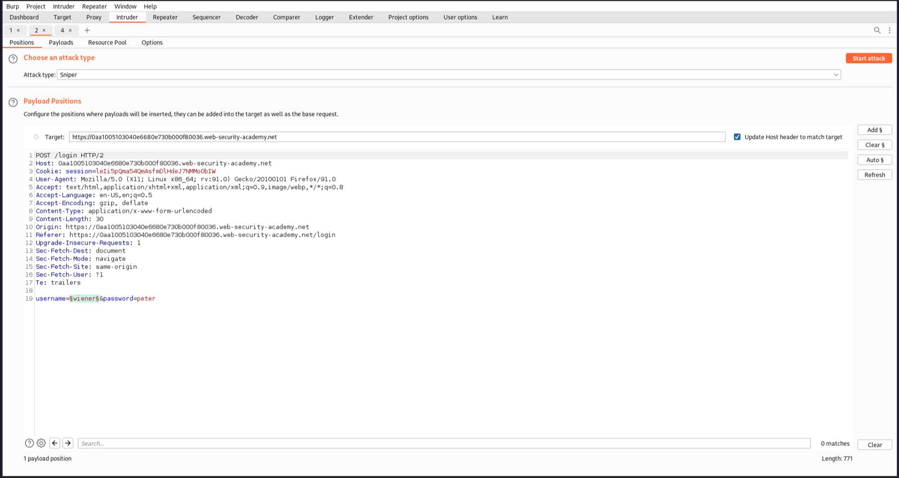
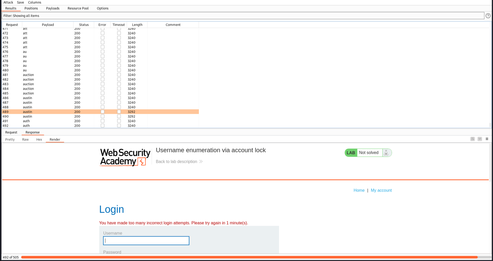
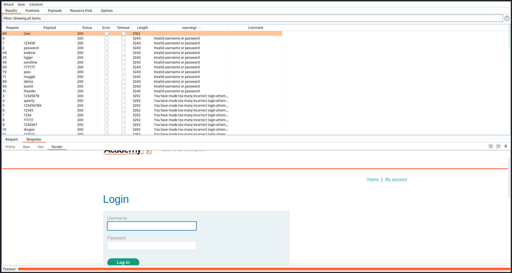
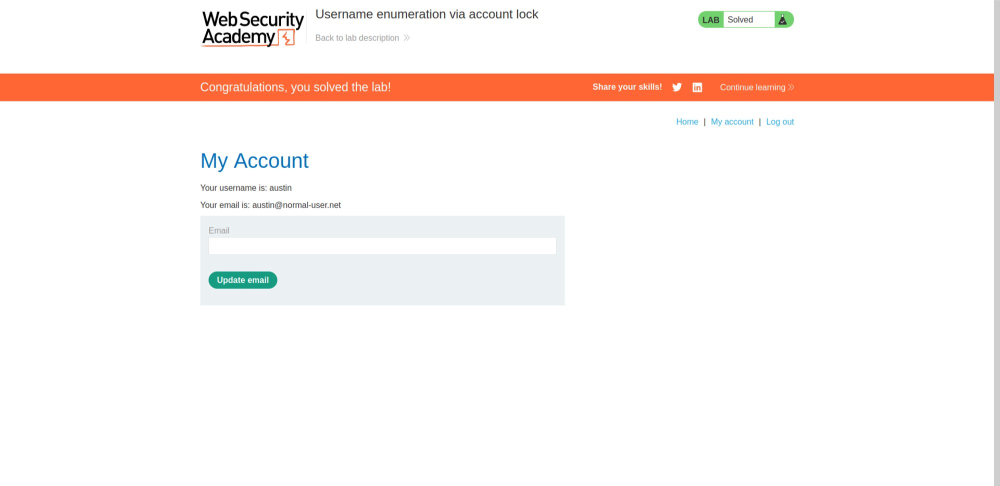

# Authentication Vulnerabilities

Solved one lab from [portswigger](https://portswigger.net/web-security/dashboard).

## [Lab 7: Username enumeration via account lock](https://portswigger.net/web-security/authentication/password-based/lab-username-enumeration-via-account-lock)

### Writeup:
- Send the login request and forward it to Intruder.
- Set a payload position at the username field and a blank payload position at the end of the password field. Use the given payloads for the username, and for the password position, use a null payload type for 5 times. 
- If this doesn't work because you are using the community version and the time for simultaneous requests exceeds the block time, try repeating the username 5 times (e.g., a a a a a b b b b b) and use them as payloads for the username field, providing any random password. By doing this, we send 5 requests with the same username simultaneously. 
- Filter the results and identify a username with a response length greater than the others. This response indicates "You have made too many incorrect login attempts. Please try again in 1 minute(s)". This means when we provide an incorrect password for a correct username, it blocks us after some tries. However, if the username itself is incorrect, it doesn't block us from trying again.
- Identify the valid username and use it to brute-force the password field.
- In the results, filter them by grepping the error message from Grep-Extract. Identify the response without any error message, which indicates the correct password.

- Log in with the identified username and password.
- The lab is solved.