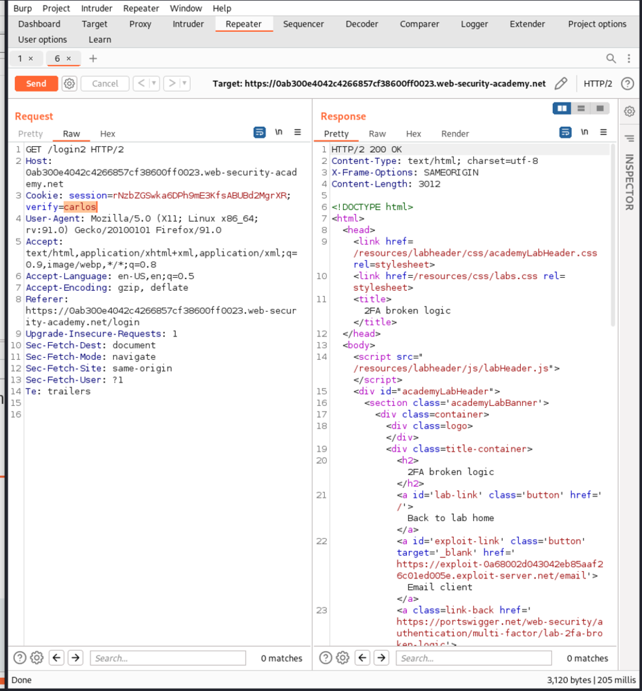
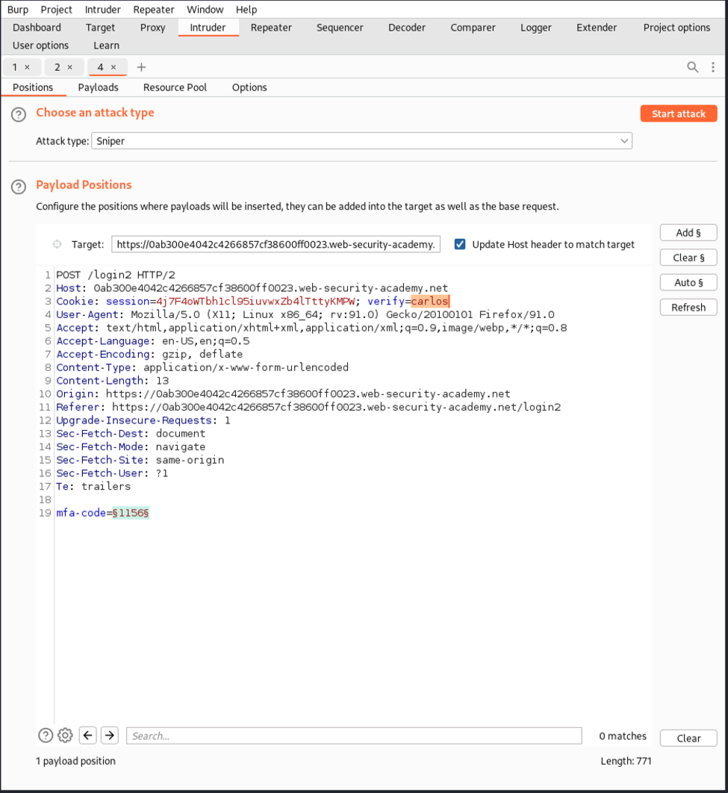
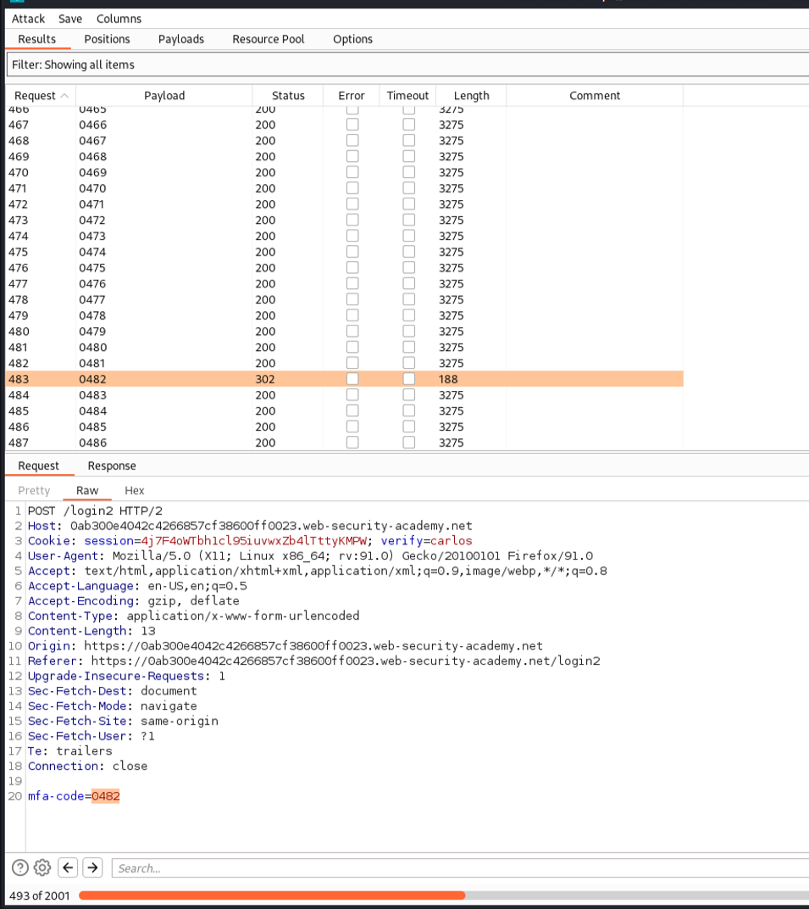
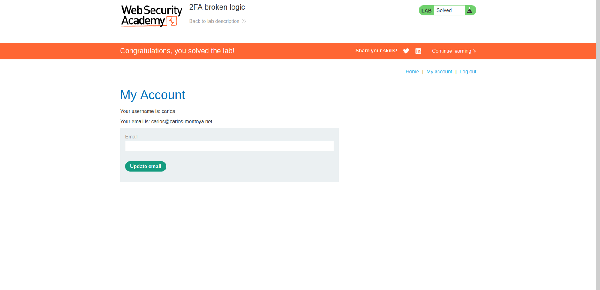

# Authentication Vulnerabilities

Solved one lab from [portswigger](https://portswigger.net/web-security/dashboard).

## [Lab 8: 2FA broken logic](https://portswigger.net/web-security/authentication/multi-factor/lab-2fa-broken-logic)

### Writeup:

- Log in with the correct username and password. It sends a POST request to ```/login``` and redirects with a GET request to ```/login2?verify=username```, which takes us to the page asking for the MFA code. Entering the code sends a POST request to ```/login2```.
- Log in and send a GET request to ```/login2```, intercept it, and change the parameter ```verify=username``` to ```verify=victim_username```. This will generate an MFA code for victim_username which we do not have access to.
- Log in to the system and send an incorrect MFA code (POST to ```/login2```), intercept it, send it to Intruder, change the parameter ```verify=username``` to ```verify=victim_username```, and brute-force the MFA code. 
- Filter the results; one of the responses will have a status code 302, indicating the correct MFA code. 
- On the response, click on "Show response in browser."
- The lab is solved. 