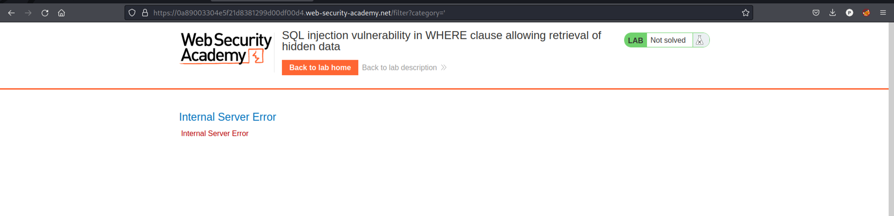
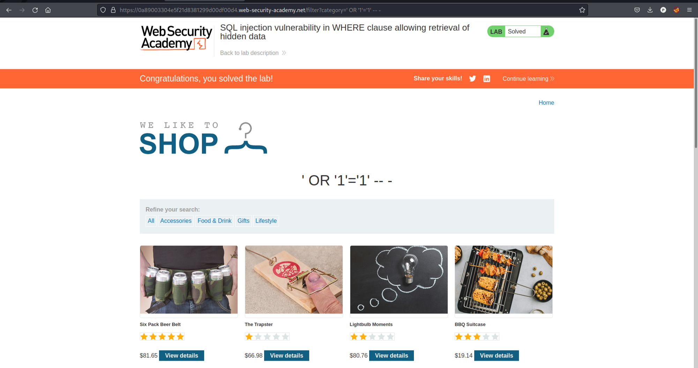

# SQL Vulnerabilities

Solved one lab from [portswigger](https://portswigger.net/web-security/dashboard).

## [Lab 9: SQL injection vulnerability in WHERE clause allowing retrieval of hidden data](https://portswigger.net/web-security/sql-injection/lab-retrieve-hidden-data)

### Writeup:
- We can see different categories, and when we click on them, the URL changes to ```category=category```.
- Change the URL parameter to ```category='```, and we get an error, indicating a potential SQL injection vulnerability.

- Modify the URL parameter to ```category=' OR '1'='1' -- - ``` to exploit the SQL injection vulnerability.
- The lab is solved. 