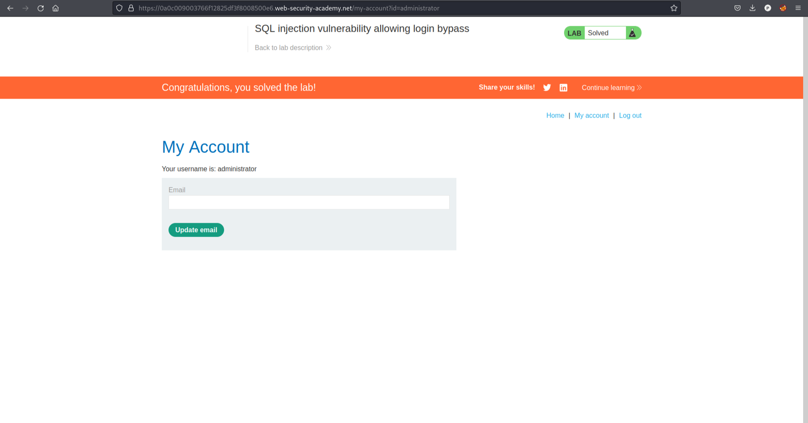

# SQL Vulnerabilities

Solved one lab from [portswigger](https://portswigger.net/web-security/dashboard).

## [Lab 10: SQL injection vulnerability allowing login bypass](https://portswigger.net/web-security/sql-injection/lab-login-bypass)

### Writeup:
- We have a login page.
- Lets login with username=```admin' or '1'='1``` and password=```password' or '1'='1``` .
- The lab is solved as it bypassed the login page. 