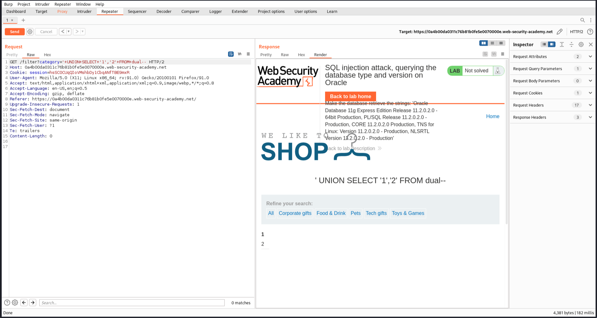
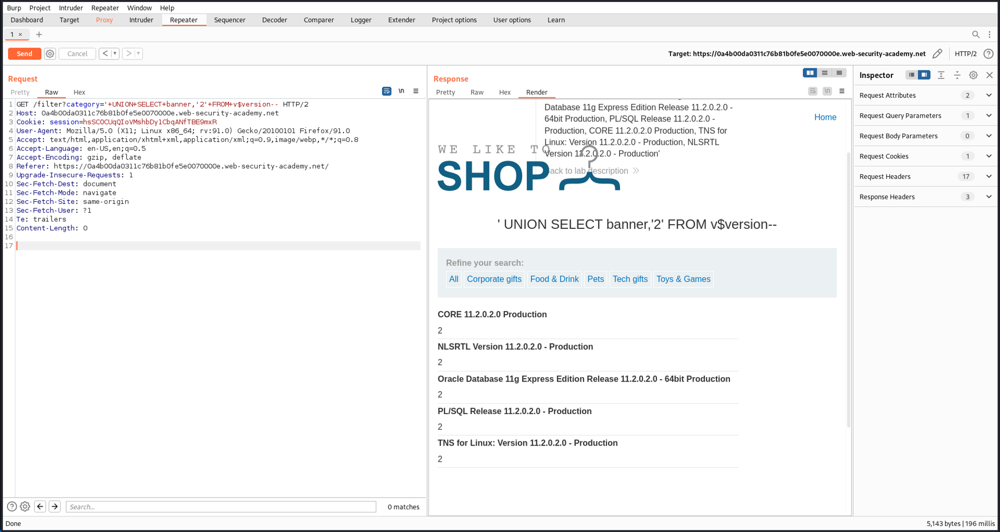
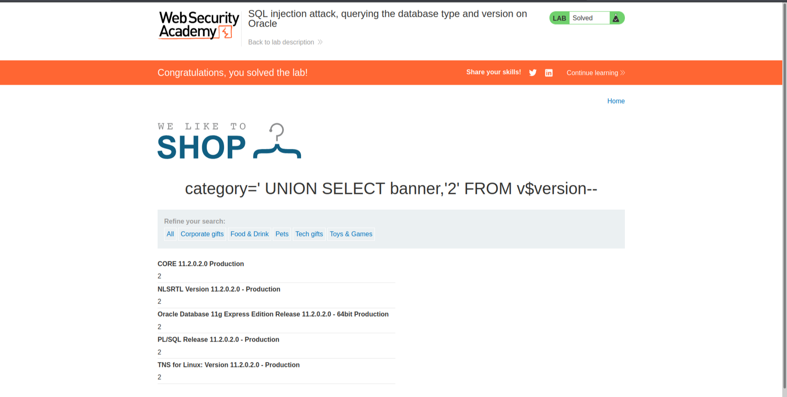

# SQL Vulnerabilities

Solved one lab from [portswigger academy](https://portswigger.net/web-security/dashboard).

## [Lab 11: SQL injection attack, querying the database type and version on Oracle](https://portswigger.net/web-security/sql-injection/examining-the-database/lab-querying-database-version-oracle)

### Writeup:
- Click on one category and intercept the request. We can see a GET request is sent to ```/filter?category=Pets```.

- Try to manipulate the query by changing it to:
```category='+UNION+SELECT+'1','2'+FROM+dual-- -```

- This returns "1" and "2" in the response, indicating that the query has two columns.


- Use this information to display the version of the database by changing the query to:
```category='+UNION+SELECT+banner,'2'+FROM+v$version--+-```

- We get the database version. 


- For Oracle databases, SELECT banner FROM v$version is used for version detection.

- The lab is solved.  

